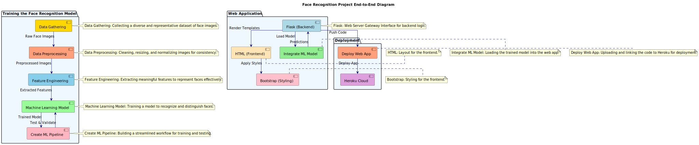

# Face Recognition Project: End-to-End Workflow

This project demonstrates a face recognition system using **OpenCV** and **Machine Learning**. The process involves data processing, model training, web application integration, and deployment.


## Workflow


<br>
1. **Preprocessing, Training and Evaluating the Model**
   - **Data Preprocessing**: Cleaning and normalizing images.
   - **Feature Engineering**: Extracting the faces and the eigenimages.
   - **Machine Learning Model**:  Training the model using SVM and othe ML algorithms for classification, and evaluating it with ensemble methods for improved performance.
> 
   - **Create ML Pipeline**: Integrating the training and testing process.
> 
<br>
2. **Web Application**
   - **Flask (Backend)**: Web server for model integration.
   - **HTML & Bootstrap (Frontend)**: User interface.
   - **Model Integration**: Load the trained model for predictions.
<br>
3. **Deployment**
   - **Deploy Web App**: App hosted on **Heroku**.!


## Installation

- Clone the repo and install dependencies:
  
   ```bash
   git clone https://github.com/amerob/face-ecognition-opencv-flask.git
   cd face-recognition-project
   ```


